  <p align="center">
  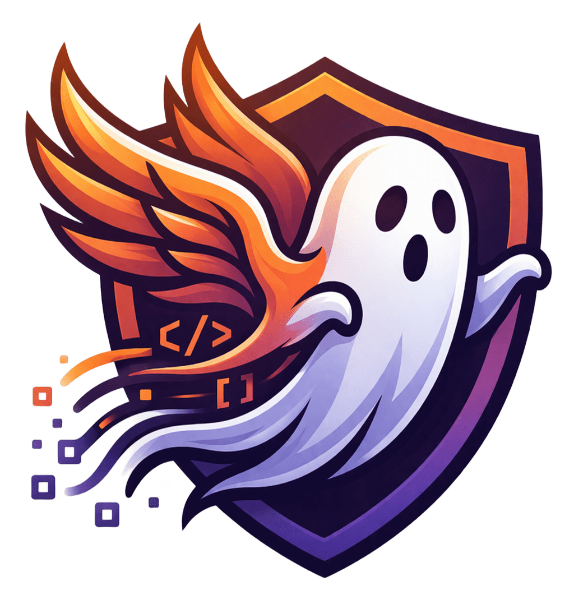
</p>

<h1 align="center">PHANTOM SWIFT</h1>

<p align="center">
  <strong>The Elite, Zero-Dependency iOS Debugging & Diagnostic Toolkit</strong>
</p>

<p align="center">
  <a href="https://github.com/synaptode/PhantomSwift/releases/tag/1.0.3">
    
  </a>
  <a href="https://github.com/synaptode/PhantomSwift/blob/master/LICENSE">
    
  </a>
  
  
  
  <a href="https://swiftpackageindex.com/synaptode/PhantomSwift">
    
  </a>
  <a href="https://swiftpackageindex.com/synaptode/PhantomSwift">
    
  </a>
</p>

<p align="center">
PhantomSwift is an open-source iOS debugging library for Swift developers.
It provides network inspection, memory leak detection, UI hierarchy exploration,
and 25+ diagnostic tools — all in a single zero-dependency package.
Compatible with UIKit and SwiftUI, installable via SPM or CocoaPods, with a minimum runtime target of iOS 12 and a validated Swift 5.9+ toolchain.
</p>

---

## Overview

**PhantomSwift** is a professional-grade, modular debugging ecosystem for iOS apps. It ships **25 rich modules** — from network inspection and performance profiling to remote WebSocket debugging and macro recording — all wrapped in a premium glassmorphic UI. Every line of code is compiled only in `DEBUG` builds, so it adds **zero overhead** to your production binary.

### Why PhantomSwift?

| | PhantomSwift | FLEX | Pulse | Netfox |
|---|:---:|:---:|:---:|:---:|
| **Zero dependencies** | ✅ | ✅ | ❌ | ✅ |
| **`#if DEBUG` safe** | ✅ | ❌ | ❌ | ❌ |
| **Network inspection** | ✅ | ✅ | ✅ | ✅ |
| **3D view hierarchy** | ✅ | ✅ | ❌ | ❌ |
| **Performance monitoring** | ✅ | ❌ | ❌ | ❌ |
| **Request interception** | ✅ | ❌ | ❌ | ❌ |
| **Bad network simulation** | ✅ | ❌ | ❌ | ❌ |
| **Feature flags** | ✅ | ❌ | ❌ | ❌ |
| **Remote WebSocket server** | ✅ | ❌ | ✅ | ❌ |
| **Memory leak tracker** | ✅ | ✅ | ❌ | ❌ |
| **Macro recorder** | ✅ | ❌ | ❌ | ❌ |
| **Security audit** | ✅ | ❌ | ❌ | ❌ |
| **Bug reporter** | ✅ | ❌ | ❌ | ❌ |
| **Glassmorphic UI** | ✅ | ❌ | ✅ | ❌ |
| **Module count** | **25** | ~8 | ~5 | 1 |

### Looking for an Alternative?

- **FLEX alternative** — PhantomSwift covers everything FLEX does, plus network mocking, bad network simulation, feature flags, and a glassmorphic UI.
- **Netfox replacement** — PhantomSwift includes all Netfox's network inspection with 25 additional modules, and is also `#if DEBUG` safe.
- **Pulse iOS alternative** — PhantomSwift adds zero-dependency constraint with full UIKit + SwiftUI support and no external packages required.

### Key Principles

- **Zero external dependencies** — built entirely with Apple frameworks
- **`#if DEBUG` safe** — every file is wrapped; nothing ships to the App Store
- **iOS 12+ runtime support** — with `#available` guards for newer APIs
- **Swift 5.x aligned** — validated with Swift 5.9+ toolchains
- **Glassmorphic UI** — premium dark theme with blur, shadows, and micro-animations
- **Modular architecture** — enable or disable any module independently

---

## Table of Contents

- [Screenshots](#screenshots)
- [Features](#features)
- [Installation](#installation)
- [Quick Start](#quick-start)
- [Modules in Detail](#modules-in-detail)
- [Architecture](#architecture)
- [Configuration](#configuration)
- [Requirements](#requirements)
- [Contributing](#contributing)
- [License](#license)

---

## Screenshots

<p align="center">
  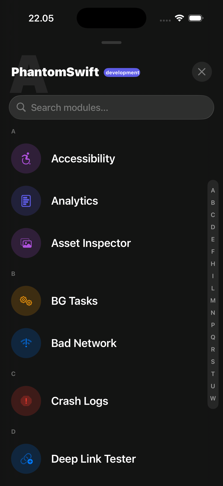
  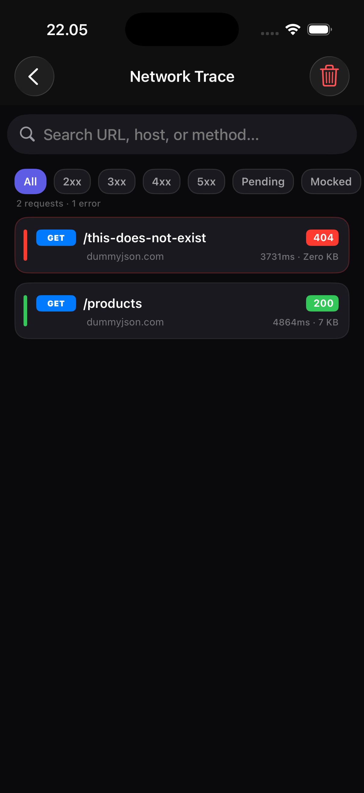
  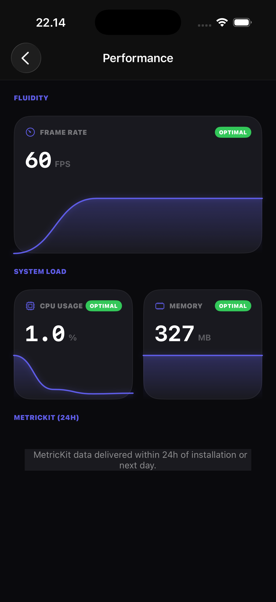
</p>
<p align="center">
  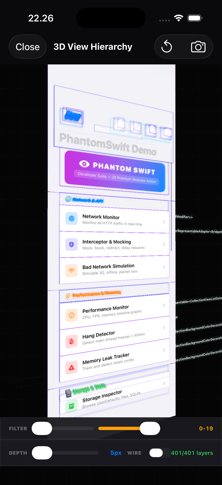
  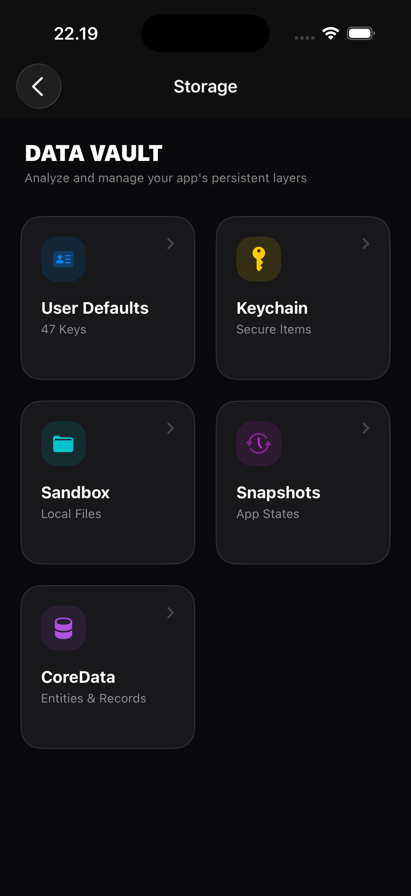
  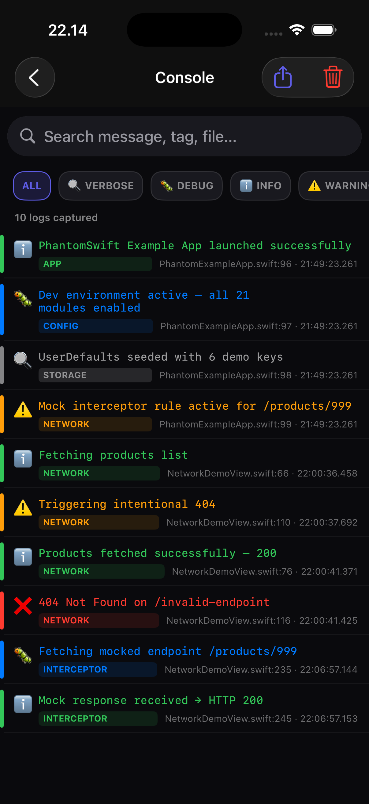
</p>
<p align="center">
  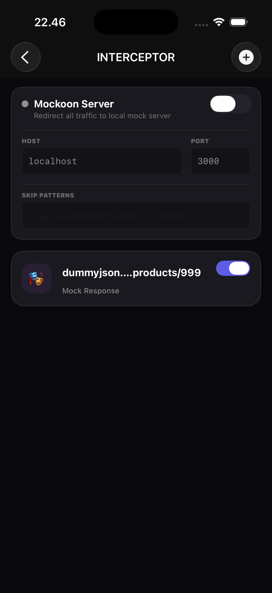
  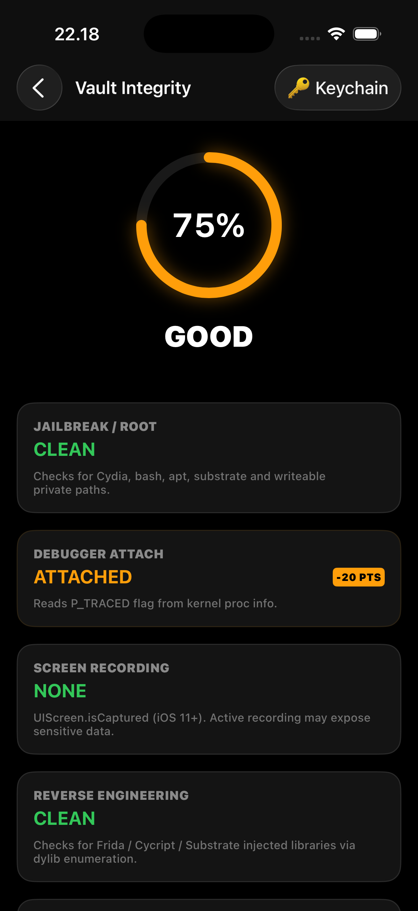
  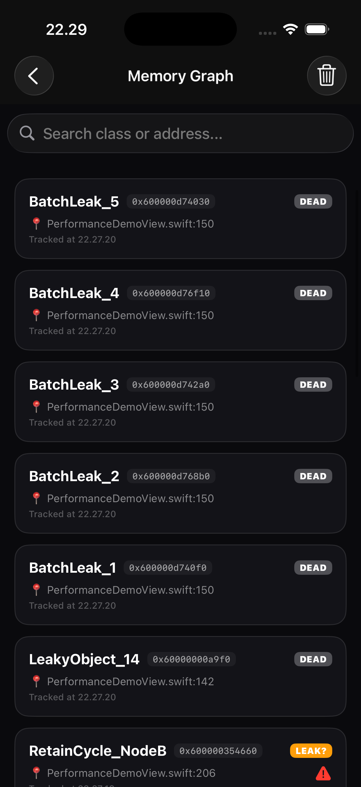
</p>

---

## Features

### Connectivity & API

| Module | Description |
|--------|-------------|
| **Network Trace** | Real-time HTTP/HTTPS traffic monitoring with full request/response inspection, HAR export, and search/filter |
| **Interceptor** | Mock, block, delay, or redirect any request. Mockoon redirect support. Hit counters and exclude patterns |
| **Bad Network** | Simulate poor connectivity (3G, Edge, packet loss, latency) with one tap |
| **Network Waterfall** | Chrome DevTools-style waterfall timeline showing request durations and concurrency |
| **Request Replay** | Edit and replay any captured request. Save responses as mock rules |
| **HAR Export** | Export network traces as HAR 1.2 JSON files for sharing with backend teams |

### Performance & Diagnostics

| Module | Description |
|--------|-------------|
| **Performance Monitor** | Real-time CPU, FPS, and RAM tracking with interactive timeline graphs |
| **Hang Detector** | Main-thread freeze detection (>400ms) with full call stack capture |
| **Main Thread Checker** | Detects UIKit calls from background threads via method swizzling |
| **Memory Leak Tracker** | Automatic retain cycle detection with object lifecycle tracking |
| **Memory Graph & Diff** | Visual object relationship explorer and heap snapshot comparator |

### UI & Design Systems

| Module | Description |
|--------|-------------|
| **UI Inspector** | Live property inspection with constraint details, measurement tool |
| **3D View Hierarchy** | Xcode-style exploded 3D view with tap-to-select, depth slider, wireframe toggle, and pinch-to-zoom |
| **SwiftUI Render Tracker** | Track re-render frequency per SwiftUI component |
| **Asset Inspector** | Audit image/video assets for memory optimization and sizing |
| **Accessibility Audit** | Scan for missing labels, small touch targets, and A11y violations |
| **Layout Conflict** | Detect and display Auto Layout constraint conflicts in real-time |

### Storage & State

| Module | Description |
|--------|-------------|
| **Storage Inspector** | Browse and edit UserDefaults, Keychain, sandbox files, and SQLite databases |
| **State Snapshot** | Save entire app state (defaults, files) and restore it instantly |

### Developer Toolkit

| Module | Description |
|--------|-------------|
| **Console Logger** | Priority-level logging with tags, metadata, and full-text search |
| **Analytics Interceptor** | Intercept and inspect analytics events (Firebase, Amplitude, custom) |
| **Feature Flags** | Register, toggle, and persist feature flags with grouped UI |
| **Bug Reporter** | Annotate screenshots with freehand drawing, export diagnostic bundles |
| **Macro Recorder** | Record touch sequences and replay them for QA regression testing |
| **Remote Server** | WebSocket debug server for real-time remote inspection |
| **Security Audit** | Jailbreak detection, SSL pinning check, and binary integrity verification |
| **Environment Swapper** | Spoof GPS, change locale, monitor battery/thermal state |
| **Runtime Browser** | Browse Objective-C classes, methods, and properties at runtime |
| **Push Notification Tester** | Simulate and test push notifications locally |
| **Deeplink Tester** | Test URL schemes and universal links without leaving the app |

---

## Installation

### Swift Package Manager (Recommended)

Add PhantomSwift via Xcode:

1. **File → Add Package Dependencies...**
2. Enter the repository URL:
   ```
   https://github.com/synaptode/PhantomSwift.git
   ```
3. Select version rule: **Up to Next Major**
4. Add to your **Debug** target only

Or add it to your `Package.swift`:

```swift
dependencies: [
    .package(url: "https://github.com/synaptode/PhantomSwift.git", from: "1.0.3")
]
```

### CocoaPods

```ruby
pod 'PhantomSwift', :configurations => ['Debug']
```

> **Important:** Always add PhantomSwift to your **Debug** configuration only. All code is wrapped in `#if DEBUG`, but restricting the dependency ensures zero bytes in release builds.
>
> **Compatibility:** PhantomSwift supports **iOS 12.0+** at runtime. The current package manifest and CocoaPods spec are validated with **Swift 5.9+** toolchains, which keeps the library within the Swift 5 generation while matching the repo's actual build settings.

---

## Quick Start

### SwiftUI

```swift
import SwiftUI
#if DEBUG
import PhantomSwift
#endif

@main
struct MyApp: App {
    init() {
        #if DEBUG
        PhantomSwift.configure { config in
            config.environment = .dev
            config.triggers = [.shake, .dynamicIsland]
            config.theme = .dark
        }
        PhantomSwift.launch()
        #endif
    }

    var body: some Scene {
        WindowGroup { ContentView() }
    }
}
```

### UIKit

```swift
import UIKit
#if DEBUG
import PhantomSwift
#endif

@main
class AppDelegate: UIResponder, UIApplicationDelegate {
    func application(_ application: UIApplication,
                     didFinishLaunchingWithOptions launchOptions: [UIApplication.LaunchOptionsKey: Any]?) -> Bool {
        #if DEBUG
        PhantomSwift.configure { config in
            config.environment = .dev
            config.triggers = [.shake]
            config.theme = .dark
            config.shortcuts = [
                AppShortcut(title: "Clear Cache") {
                    URLCache.shared.removeAllCachedResponses()
                }
            ]
        }
        PhantomSwift.launch()
        #endif
        return true
    }
}
```

### Accessing the Dashboard

| Trigger | How |
|---------|-----|
| **Shake** | Shake your device (default trigger) |
| **Dynamic Island** | Tap the floating pill overlay |

Both triggers can be configured via `config.triggers`.

---

## Modules in Detail

### 📋 Dashboard

The central hub for all PhantomSwift modules. A Niagara-style A→Z scrollable grid displays every available module with a glassmorphic card UI.

<p align="center">
  
</p>

The dashboard provides quick access to all 25 modules. Each card shows the module icon, name, and a brief description. Enabled modules are highlighted with a colored accent glow.

---

### 🌐 Network Trace

Automatically captures all HTTP/HTTPS traffic via `URLProtocol` swizzling. Provides a detailed view of every request and response flowing through your app.

<p align="center">
  
  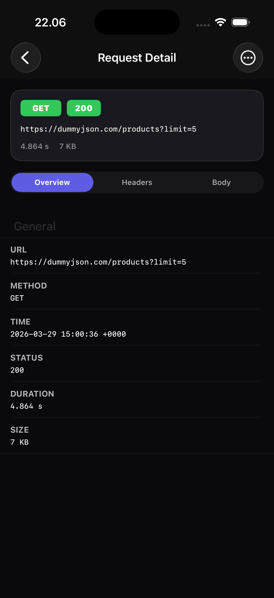
  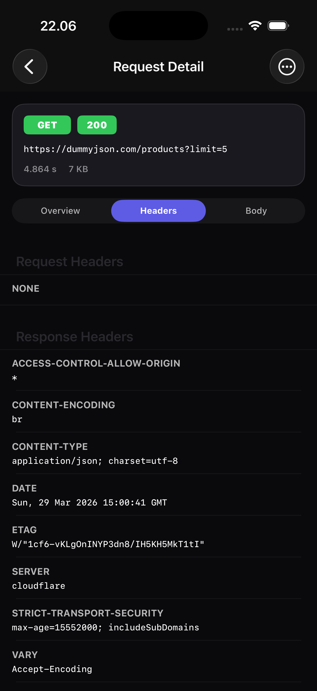
  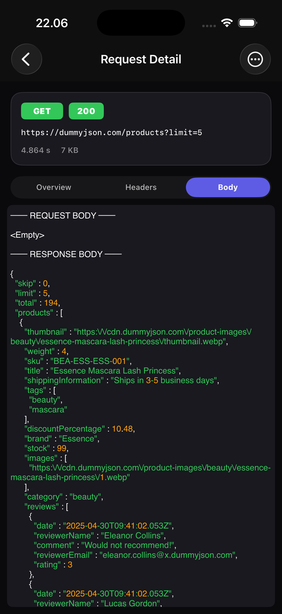
</p>

**Capabilities:**
- Full request/response body inspection with JSON pretty-printing
- Status code color-coding (2xx green, 4xx orange, 5xx red)
- Header inspection with copy-to-clipboard
- Text search and status code filtering
- HAR 1.2 export for sharing with backend teams
- Request edit & replay
- Automatic content-type detection (JSON, XML, HTML, image)

---

### 🚧 Interceptor

Create rules to intercept matching network requests. Supports multiple interception strategies to simulate various backend scenarios without modifying server code.

<p align="center">
  
</p>

**Rule Types:**
| Type | Description |
|------|-------------|
| **Mock** | Return a custom JSON/text response body |
| **Block** | Prevent the request from executing entirely |
| **Redirect** | Forward to a different URL (e.g., Mockoon server) |
| **Delay** | Add artificial latency (100ms – 30s) |

**Features:**
- URL pattern matching with wildcards
- Hit counter per rule
- Exclude patterns to bypass specific endpoints
- Per-rule enable/disable toggle
- Import/export rule sets

---

### 📡 Bad Network Simulator

Simulate poor network conditions to test your app’s resilience — no proxy tools or extra setup required.

<p align="center">
  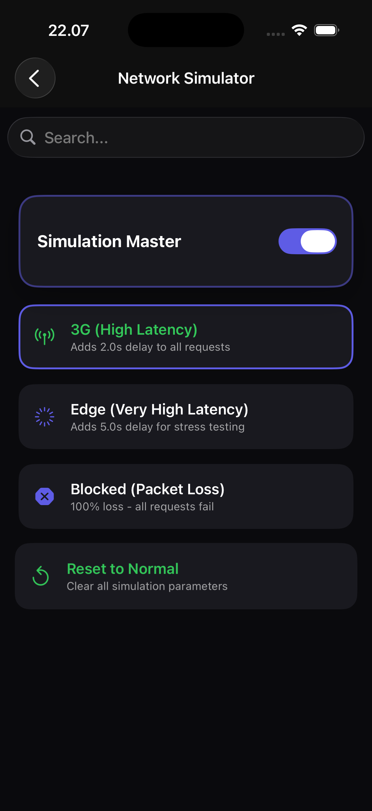
</p>

**Presets:**
| Profile | Latency | Throughput | Packet Loss |
|---------|---------|------------|-------------|
| **WiFi** | 2ms | Unlimited | 0% |
| **4G/LTE** | 50ms | 12 Mbps | 1% |
| **3G** | 200ms | 1.6 Mbps | 2% |
| **Edge** | 400ms | 240 Kbps | 5% |
| **GPRS** | 500ms | 50 Kbps | 10% |
| **Offline** | ∞ | 0 | 100% |

All parameters (latency, throughput, packet loss) are individually adjustable with sliders for custom profiles.

---

### 📊 Network Waterfall

Chrome DevTools-style waterfall timeline showing request durations and concurrency — a visual overview of how your network requests overlap in time.

<p align="center">
  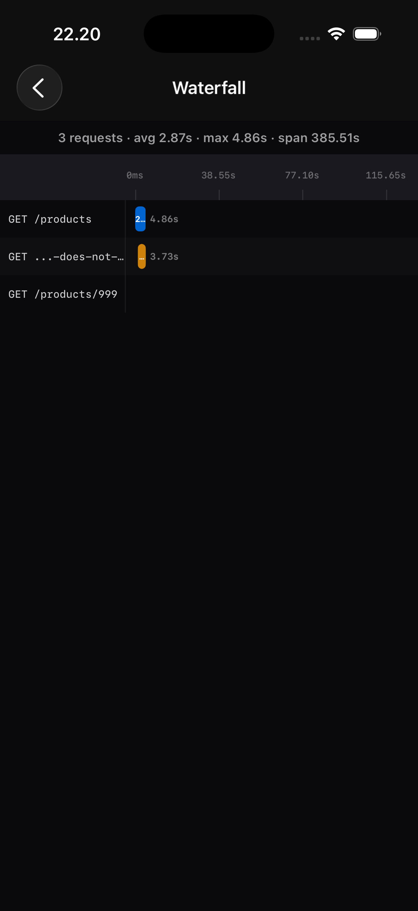
</p>

**What it shows:**
- DNS lookup, connection, SSL, TTFB, and content download phases
- Concurrent request overlap visualization
- Color-coded bars by content type (API, image, script)
- Total page load time calculation
- Tap any bar to jump to the full request detail

---

### ⚡ Performance Monitor

Real-time CPU, FPS, and RAM tracking with interactive timeline graphs. Spot performance bottlenecks as they happen.

<p align="center">
  
</p>

**Metrics tracked:**
- **CPU Usage** — per-process CPU utilization percentage
- **FPS** — frames per second from `CADisplayLink` (drops highlighted in red)
- **Memory** — resident set size (RSS) in MB with peak tracking
- **Thermal State** — device thermal state monitoring (nominal → critical)

Interactive timeline lets you scrub through the last 60 seconds of data. Anomalies (FPS drops, CPU spikes, memory warnings) are highlighted with markers.

---

### 📝 Console Logger

A priority-level logging system with tags, metadata, and full-text search. Replaces `print()` with structured, filterable output.

<p align="center">
  
</p>

**Usage:**

```swift
#if DEBUG
PhantomLog.debug("View loaded", tag: "UI")
PhantomLog.info("User signed in", tag: "Auth")
PhantomLog.warning("Cache miss for key: \(key)", tag: "Cache")
PhantomLog.error("Failed to decode response", tag: "Network")
#endif
```

**Features:**
- Five priority levels: `verbose`, `debug`, `info`, `warning`, `error`
- Tag-based filtering (e.g., show only "Network" logs)
- Full-text search across all log entries
- Timestamp with millisecond precision
- Export logs as text file
- OSLog bridge for unified logging (iOS 14+)

---

### 🔍 UI Inspector & 3D Hierarchy

Inspect any view in your app hierarchy — tap to select, view properties, constraints, and spatial relationships. The 3D exploded view provides an Xcode-style visualization of the entire view tree.

<p align="center">
  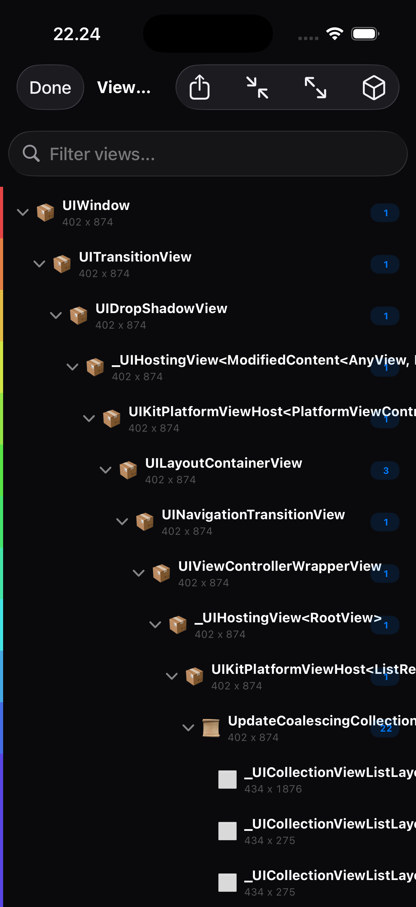
  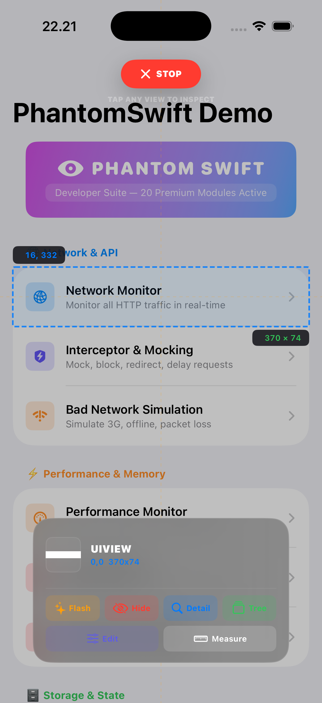
  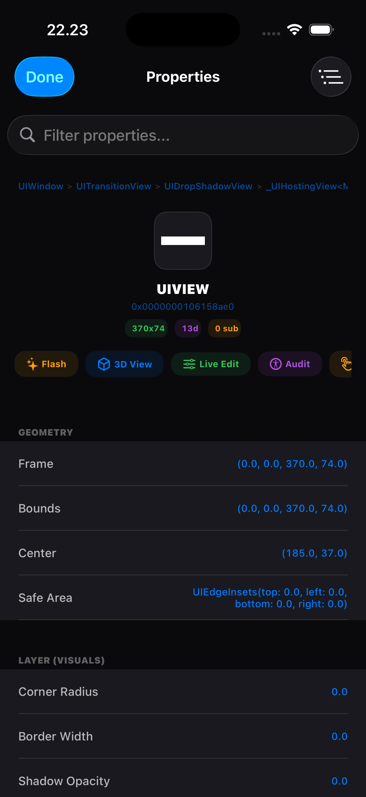
</p>

**UI Inspector features:**
- Tap-to-select any view in the hierarchy
- Property inspection: frame, bounds, alpha, backgroundColor, accessibilityLabel
- Constraint list with priority, constant, multiplier
- Live editing of properties (frame, alpha, backgroundColor)
- Measurement tool — measure distance between any two views

<p align="center">
  
  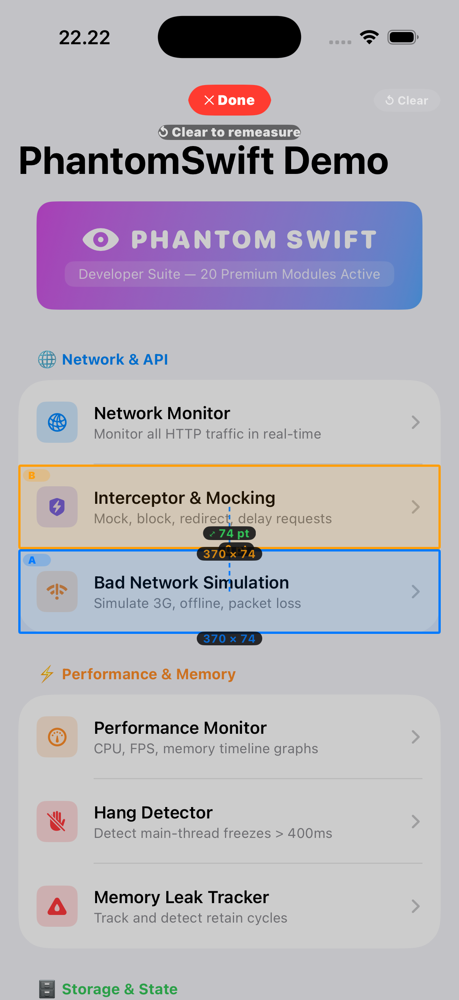
  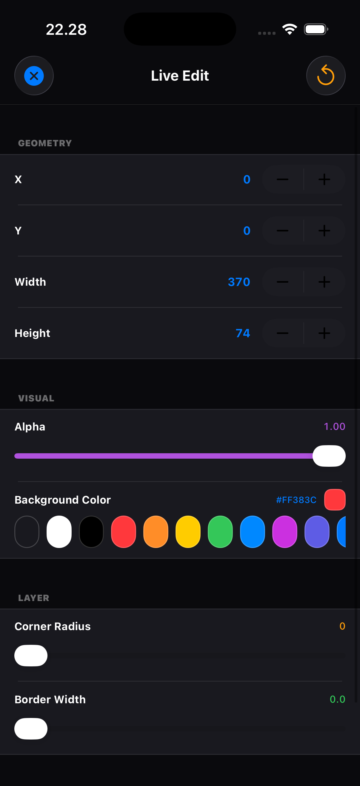
</p>

**3D Hierarchy features:**
- Exploded 3D view with adjustable spacing
- Depth filter slider to focus on specific layers
- Rotate X/Y sliders for precise camera control
- Wireframe mode to see layout structure
- Class name labels overlay
- Tap any layer to open the inspector sheet
- Pinch to zoom, 1-finger pan, 2-finger orbit
- Fit All & Reset camera controls
- Mini-map overlay for orientation

---

### 🧠 Memory Leak Tracker & Graph

Automatic retain cycle detection with object lifecycle tracking. The memory graph visualizes object relationships to help identify where leaks occur.

<p align="center">
  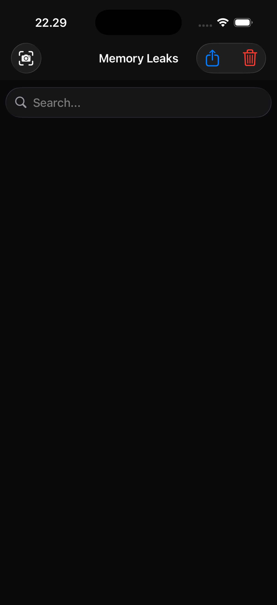
  
</p>

**Leak Tracker:**
- Tracks `UIViewController` and `UIView` lifecycle via swizzling
- Detects objects that are not deallocated after dismissal (potential leaks)
- Shows class name, allocation time, and retain count
- Configurable detection delay (default: 3s after dismissal)

**Memory Graph:**
- Visual directed graph of object references
- Interactive nodes — tap to inspect properties
- Snapshot comparison (diff between two heap states)
- Highlights potential retain cycles with red edges

---

### 💾 Storage Inspector

Browse and edit all local storage mechanisms from a single interface.

<p align="center">
  
</p>

**Supported storage types:**
| Storage | Capabilities |
|---------|-------------|
| **UserDefaults** | Browse, edit, delete keys. Type-aware editing (String, Int, Bool, Date, Array, Dictionary) |
| **Keychain** | Read and delete keychain items. Filtered by app’s access group |
| **Sandbox Files** | Navigate the app’s Documents, Library, and tmp directories. View file contents, sizes, dates |
| **SQLite** | Browse tables, execute raw SQL queries, view schema |

All edits are reflected immediately — no app restart needed.

---

### 📈 Analytics Interceptor

Intercept and inspect analytics events from any provider without modifying your analytics code.

<p align="center">
  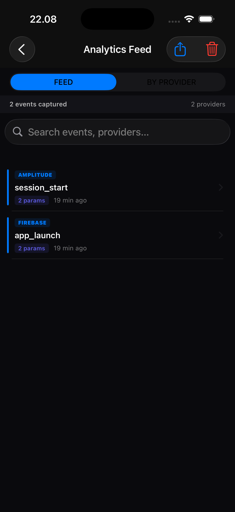
  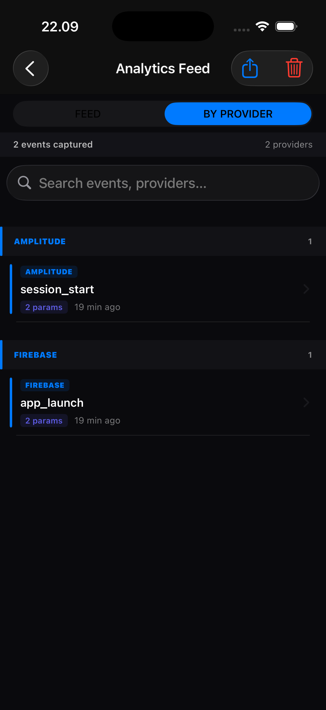
</p>

**Supported providers:**
- Firebase Analytics
- Amplitude
- Mixpanel
- Custom event buses

**Features:**
- Real-time event feed with timestamp, name, and parameters
- Group-by-provider view to see event distribution
- Search and filter by event name or parameter value
- Event validation — warns about missing required parameters

---

### 🚩 Feature Flags

Runtime feature flag management with a beautiful grouped UI. Toggle features on-the-fly without recompilation.

```swift
#if DEBUG
// Register flags at launch
PhantomFeatureFlags.shared.register(key: "new_onboarding", title: "New Onboarding Flow",
                                     defaultValue: false, group: "UX")
PhantomFeatureFlags.shared.register(key: "dark_mode_v2", title: "Dark Mode V2",
                                     defaultValue: true, group: "Theme")

// Check flags anywhere
if PhantomFeatureFlags.shared.isEnabled("new_onboarding") {
    showNewOnboarding()
}
#endif
```

**Features:**
- Register flags with key, title, description, default value, and group
- Toggle overrides from the dashboard with immediate effect
- Overrides persist across app launches via UserDefaults
- Reset individual flags or all at once
- Override badge count shown on the dashboard card

---

### 🔒 Security Audit

Comprehensive security analysis of your app’s runtime environment.

<p align="center">
  
  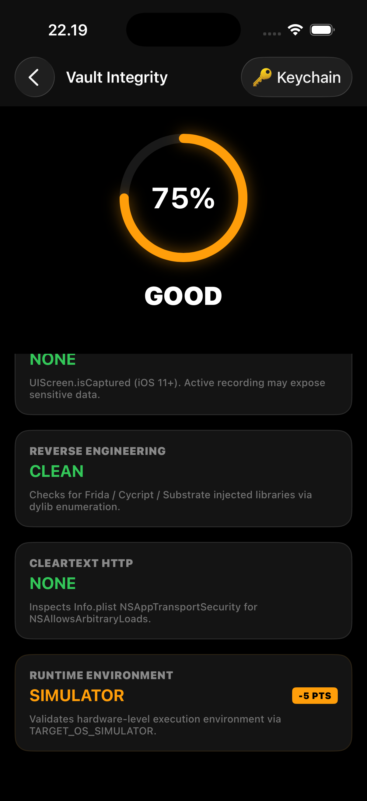
</p>

**Checks performed:**
| Check | Description |
|-------|-------------|
| **Jailbreak Detection** | Checks for Cydia, unusual paths, writable system dirs |
| **SSL Pinning** | Validates certificate pinning implementation |
| **Debugger Detection** | Detects if a debugger is attached |
| **Binary Integrity** | Checks code signature and encryption status |
| **Keychain Security** | Validates keychain access control settings |
| **App Transport Security** | Checks ATS exceptions in Info.plist |

Results are color-coded: 🟢 Pass, 🟡 Warning, 🔴 Fail — with remediation suggestions.

---

### 🖼 Asset Inspector

Audit image and video assets for memory optimization, sizing, and potential issues.

<p align="center">
  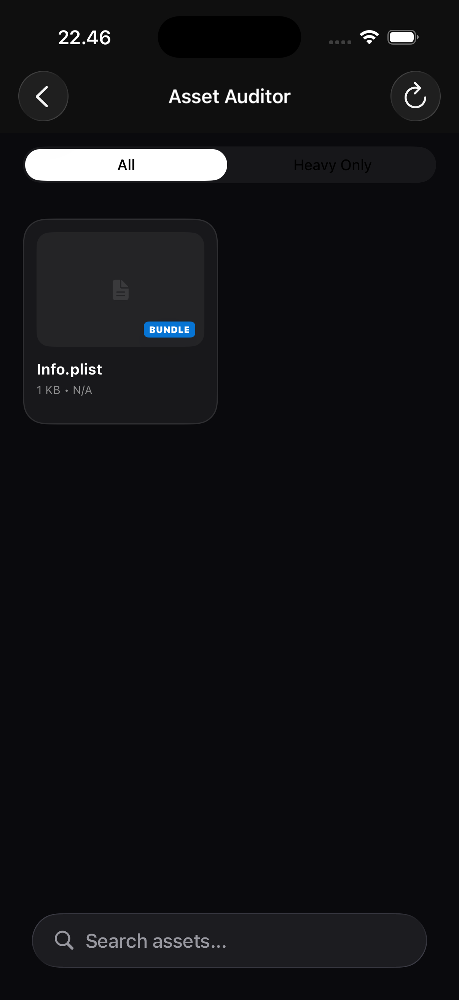
</p>

**Analysis includes:**
- Image dimensions vs. display size (flags oversized images)
- Memory footprint calculation per asset
- Format identification (PNG, JPEG, HEIF, WebP, PDF)
- Missing @2x/@3x variants detection
- Total asset catalog size summary

---

### 🌍 Environment Swapper

Override device environment settings for testing — no need to physically move or change device settings.

<p align="center">
  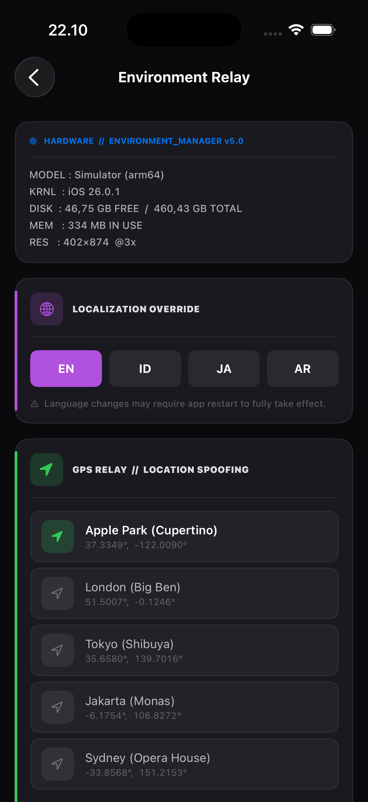
  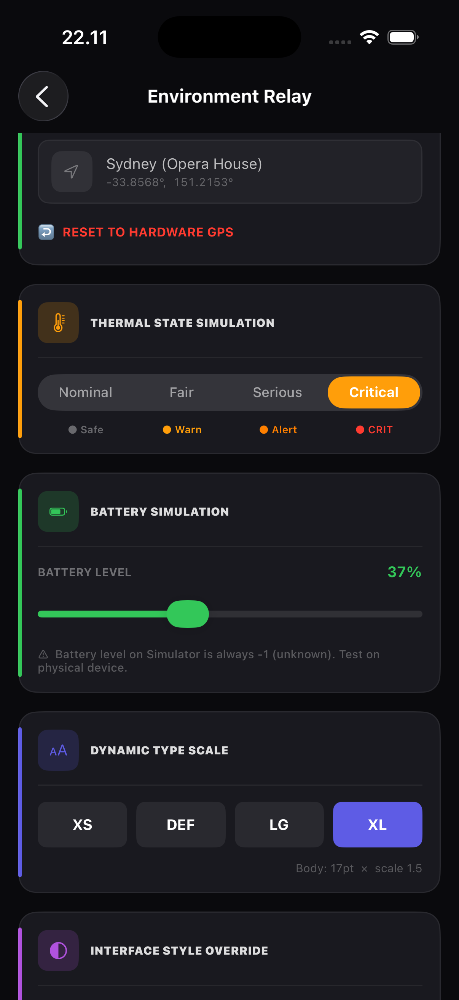
  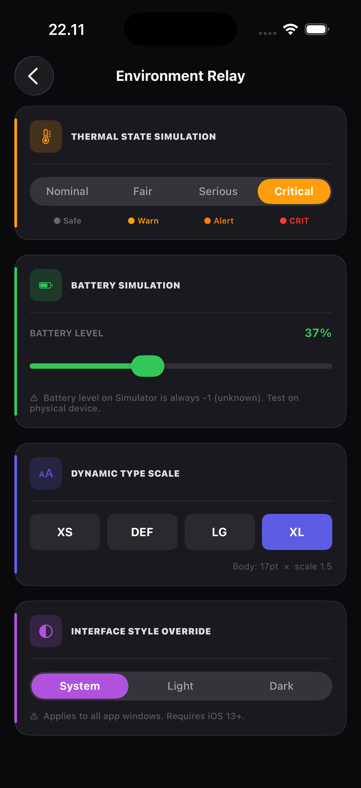
</p>

**Capabilities:**
- **GPS Spoofing** — Set custom coordinates for location-dependent features
- **Locale Override** — Change app locale without changing device settings
- **Battery Monitoring** — Real-time battery level and charging state
- **Thermal State** — Monitor device temperature state
- **Time Zone Override** — Test time-sensitive features across zones

---

### 🔬 Runtime Browser

Browse Objective-C classes, methods, and properties at runtime — a powerful introspection tool for understanding third-party SDKs.

<p align="center">
  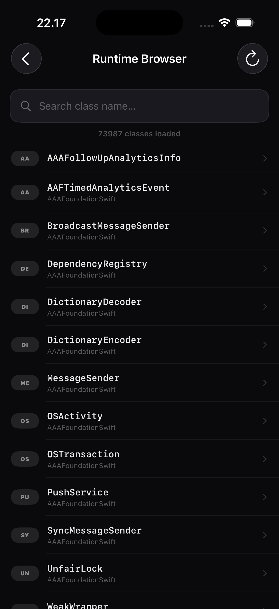
</p>

**Features:**
- Browse all loaded Objective-C classes
- Inspect instance methods, class methods, and properties
- View method signatures and return types
- Search by class name or method name
- Filter by framework/module

---

### ⚠️ Layout Conflict Detector

Detects Auto Layout constraint conflicts in real-time and displays them in a clear, actionable format.

<p align="center">
  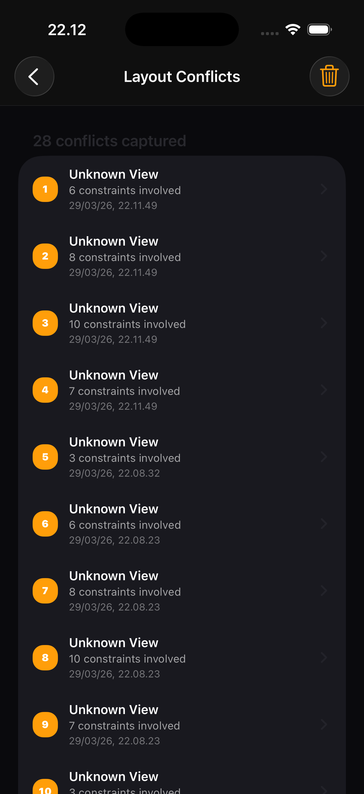
</p>

**Features:**
- Captures `UIViewAlertForUnsatisfiableConstraints` breakpoint output
- Parses conflicting constraint sets into readable format
- Shows which views and constraints are involved
- Suggests which constraint to remove or lower priority

---

### 🔔 Push Notification Tester

Simulate and test push notifications locally without a backend or APNs configuration.

<p align="center">
  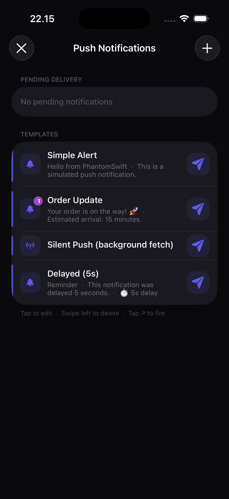
</p>

**Features:**
- Create custom notification payloads (title, body, badge, sound)
- Schedule local notifications with configurable delay
- Test deep link routing from notification taps
- Preview notification appearance before sending

---

### 🔗 Deeplink Tester

Test URL schemes and universal links without leaving the app.

<p align="center">
  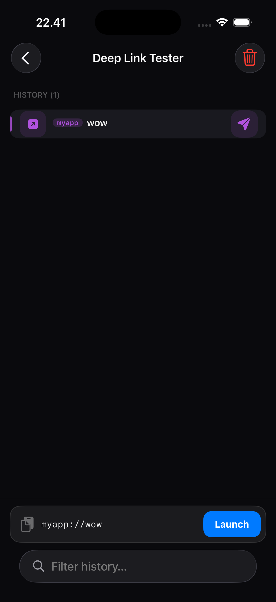
</p>

**Features:**
- Input any URL scheme or universal link
- Execute deep links within the app context
- History of recently tested links
- Quick-access bookmarks for frequently tested routes

---

### 🖥 Remote WebSocket Server

Start a WebSocket server on the device. Connect from any WebSocket client (browser, Postman, custom tool) and query your app’s state in real time.

```swift
#if DEBUG
if #available(iOS 13.0, *) {
    PhantomRemoteServer.shared.start(port: 9876)
}
// Connect from browser: ws://<device-ip>:9876
// Send JSON: {"command": "logs"} or {"command": "network-trace"}
#endif
```

**Available Commands:**

| Command | Description |
|---------|-------------|
| `app-info` | App bundle info, device model, iOS version |
| `system-status` | CPU, memory, disk usage |
| `logs` | Last 50 log entries |
| `network-trace` | Last 50 network requests |
| `feature-flags` | All registered feature flags |
| `toggle-flag` | Toggle a feature flag (params: `key`) |
| `performance` | Current metrics + 30-sample history |
| `clear-logs` | Clear the log store |
| `clear-network` | Clear captured network requests |
| `help` | List available commands |

A built-in web echo page is included at `Resources/web-echo/index.html` for quick browser-based testing.

---

## Architecture

```
Sources/PhantomSwift/
├── Core/                           # Framework core
│   ├── PhantomSwift.swift          # Main entry point & setup
│   ├── PhantomFeature.swift        # Feature enum (25 cases)
│   ├── PhantomEventBus.swift       # Thread-safe event system
│   ├── PhantomConfig.swift         # Configuration struct
│   ├── PhantomEnvironment.swift    # Environment enum
│   └── PhantomPlugin.swift         # Plugin protocol
├── HUD/                            # Dashboard & presentation
│   ├── PhantomDashboardVC.swift    # Niagara-style A→Z dashboard
│   ├── PhantomTheme.swift          # Glassmorphic design tokens
│   ├── PhantomHUDWindow.swift      # Overlay window management
│   ├── PhantomGestureHandler.swift # Shake/Dynamic Island trigger
│   └── PhantomDynamicIsland.swift  # Dynamic Island floating pill
├── Modules/                        # Feature modules
│   ├── Network/                    # Network trace, waterfall, HAR, replay
│   ├── Interceptor/                # Request mocking & redirection
│   ├── Logger/                     # Console logger with levels & tags
│   ├── Performance/                # CPU/FPS/RAM monitor & timeline
│   ├── MemoryLeak/                 # Leak tracker & object graph
│   ├── UIInspector/                # UI inspection & 3D hierarchy
│   ├── Storage/                    # UserDefaults, Keychain, SQLite, Sandbox
│   ├── QA/                         # Bug reporter, macro recorder, shortcuts
│   ├── Security/                   # Security audit & checks
│   ├── Analytics/                  # Analytics event interceptor
│   ├── SwiftUI/                    # Render body tracker
│   ├── FeatureFlags/               # Feature flag management
│   ├── MainThreadChecker/          # Background thread violation detection
│   ├── RuntimeBrowser/             # ObjC runtime introspection
│   ├── Assets/                     # Asset inspector & optimization
│   ├── Remote/                     # WebSocket debug server
│   └── Core/                       # Extension bus & shared module utils
└── Shared/                         # Shared utilities
    ├── Components/                 # Reusable UI (PhantomTableVC, badges, code view)
    ├── Extensions/                 # UIColor+Phantom, UIFont+Phantom, etc.
    └── Helpers/                    # Swizzler, formatters, utilities
```

### Design Patterns

| Pattern | Usage |
|---------|-------|
| **Singletons** | Module managers (`PhantomLog.shared`, `PhantomFeatureFlags.shared`) |
| **Event Bus** | `PhantomEventBus` for decoupled module communication |
| **Thread Safety** | `DispatchQueue(attributes: .concurrent)` with `.barrier` writes |
| **Base VC** | `PhantomTableVC` for consistent list UIs across modules |
| **Theme System** | `PhantomTheme` for centralized styling — never hardcode colors |
| **Swizzler** | `PhantomSwizzler` for safe method swizzling |

---

## Configuration

```swift
PhantomSwift.configure { config in
    // Environment (default: .dev)
    config.environment = .dev       // .dev | .staging | .release

    // Dashboard triggers
    config.triggers = [.shake, .dynamicIsland]

    // Theme
    config.theme = .dark            // .dark | .light | .auto

    // Custom QA shortcuts
    config.shortcuts = [
        AppShortcut(title: "Reset Onboarding") {
            UserDefaults.standard.removeObject(forKey: "hasSeenOnboarding")
        },
        AppShortcut(title: "Force Crash") {
            fatalError("Debug crash triggered")
        }
    ]
}
```

### Configuration Options

| Option | Type | Default | Description |
|--------|------|---------|-------------|
| `environment` | `PhantomEnvironment` | `.dev` | Current build environment |
| `triggers` | `[PhantomTrigger]` | `[.shake]` | How to open the dashboard |
| `theme` | `PhantomThemeMode` | `.dark` | UI theme mode |
| `shortcuts` | `[AppShortcut]` | `[]` | Custom QA actions in dashboard |

---

## Requirements

| Requirement | Minimum |
|-------------|---------|
| iOS | 12.0+ |
| Swift | 5.9+ |
| Xcode | 15.0+ |
| Dependencies | None |

> **iOS Compatibility Notes:**
> - **iOS 12–12.x:** Core functionality works. SF Symbols replaced with text/Menlo fallbacks.
> - **iOS 13+:** Full SF Symbols, `UINavigationBarAppearance`, monospaced digit fonts.
> - **iOS 13+:** Remote WebSocket Server requires `Network.framework` (`NWListener`).
> - **iOS 14+:** OSLog bridge for unified logging.
>
> **Swift Compatibility Notes:**
> - **Swift 5.x:** PhantomSwift is maintained in the Swift 5 family.
> - **Swift 5.9+:** Current package manifest, CocoaPods spec, CI verification, and documentation are validated against Swift 5.9+ toolchains.

---

## Contributing

Contributions are welcome! Please follow these guidelines:

1. **Fork** the repository
2. Create a **feature branch**: `git checkout -b feature/my-feature`
3. **Commit** with clear messages: `git commit -m "Add: macro recorder export as JSON"`
4. **Push** to your fork: `git push origin feature/my-feature`
5. Open a **Pull Request**

### Code Standards

- Wrap ALL code in `#if DEBUG` / `#endif`
- Use `PhantomTheme.shared` for colors/fonts — never hardcode
- Use `[weak self]` in closures that may outlive the caller
- No force unwraps (`!`) — use `guard`/`if let`
- Use `PhantomSwizzler` for method swizzling
- Prefix public types with `Phantom`
- Build UI programmatically — no storyboards or XIBs
- Use `NSLayoutConstraint.activate([...])` for Auto Layout
- Wrap iOS 13+ APIs in `if #available(iOS 13.0, *)`

---

## License

PhantomSwift is released under the **MIT License**. See [LICENSE](LICENSE) for details.

---

<p align="center">
  <sub>Built with precision for iOS engineers who demand the best debugging tools.</sub>
</p>
